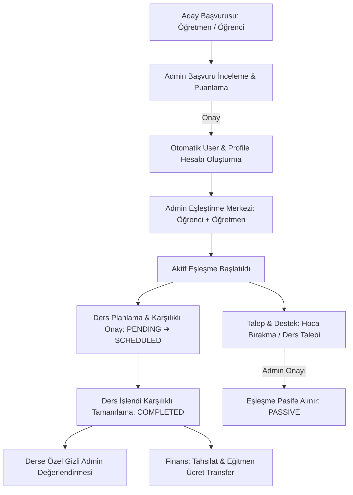

# 🏛️ Pont Academy - Sistem Mimarisi, Rol Matrisi & Uçtan Uca İş Akışları Rehberi

Bu doküman, Pont Academy platformunun canlıya (Production) geçiş öncesi mimari yapısını, rol bazlı yetkilendirme (RBAC) kurallarını, veritabanı ilişkilerini ve uçtan uca tüm iş akışlarını detaylandırmaktadır.

---

## 👥 1. Rol Bazlı Erişim & Yetkilendirme Matrisi (RBAC)

Platformda 3 ana kullanıcı rolü ve 1 anonim misafir rolü bulunmaktadır:

| Rol | Panel / Rotalar | Erişim Yetkileri & Sorumluluklar |
| :--- | :--- | :--- |
| **👑 ADMIN (Yönetici)** | `/admin/*` `/api/admin/*` | • Tüm başvuruları inceleme, puanları düzenleme ve onaylama/reddetme. • Öğrenci ve öğretmen eşleştirmeleri oluşturma, düzenleme, eğitmen değiştirme, pasife/aktife alma. • Tüm ders oturumlarını izleme, onay/ret müdahalesi, gizli değerlendirmeleri okuma. • Tahsilat (Öğrenci ➔ Kurum) ve Ücret Transferi (Kurum ➔ Eğitmen) finansal onayları. • Talep Yönetim Merkezi üzerinden şikayet, bırakma ve ders taleplerini yanıtlama. • Genel sistem ve platform ayarlarını yönetme. |
| **👨‍🏫 TEACHER (Eğitmen)** | `/teacher/*` `/api/teacher/*` | • Kendisine atanmış öğrencileri, iletişim ve konum detaylarını görüntüleme. • Ders oturumu planlama, gelen ders randevularını onaylama/reddetme. • Tamamlanan dersler için işlendi onayı verme ve admin'e özel gizli değerlendirme yazma. • Hesabına aktarılan ders ücretlerini ve transfer kanıtlarını (dekont vb.) salt okunur görüntüleme. • Öğrenci bırakma ve öğrenci şikayet taleplerini yönetime iletme. • Kendi ders yetkinlik puanlarını ve profil/iletişim bilgilerini düzenleme. |
| **👨‍🎓 STUDENT (Öğrenci)** | `/student/*` `/api/student/*` | • Kendisine atanmış eğitmenleri, branşlarını ve konum/ulaşım bilgilerini görüntüleme. • Yüz yüze (kayıtlı adresiyle) veya online ders oturumu talep etme. • Eğitmenin oluşturduğu ders randevularını onaylama veya gerekçeli reddetme. • Tamamlanan dersler için işlendi onayı verme ve gizli yönetici değerlendirmesi bırakma. • Profilinde almak istediği dersleri yönetme (işlenmemiş ders varsa silme korumalı). • Profilindeki eşleşmemiş dersler için Yeni Ders Talebi oluşturma. • Eğitmen değiştirme / bırakma ve genel şikayet/destek taleplerini yönetime iletme. |
| **🌐 GUEST (Ziyaretçi)** | `/*`, `/ozel-ders-basvuru` `/kocluk-basvuru` `/teacherApplicationForm` | • Kurumsal sayfaları inceleme. • Özel ders, koçluk veya öğretmenlik başvurusu yapma (fotoğraf yükleme dahil). • Sisteme giriş yapma (`/login`). |

---

## 🔄 2. Uçtan Uca İş Akışları Tablosu (System Flow Matrix)

### Detaylı İş Akışları Özeti:

| No | İş Akışı Adı | Tetikleyici | İlgili Sayfa / Servis | İş Mantığı & Güvenlik Doğrulamaları |
| :---: | :--- | :--- | :--- | :--- |
| **1** | **Başvuru & Hesap Açılışı** | Aday web formunu doldurur | `/teacherApplicationForm` `/ozel-ders-basvuru` `/kocluk-basvuru` `ApplicationService` | • Fotoğraf R2/Storage'a yüklenir. • Admin başvuru detayında TYT/AYT ders puanlarını düzenleyebilir. • Onaylandığında otomatik `User`, `TeacherProfile`/`StudentProfile` açılır, fotoğraf ve dersler hesaba aktarılır. • İlk giriş için şifre sıfırlama bayrağı (`mustChangePassword: true`) açılır. |
| **2** | **Ders / Koçluk Eşleştirmesi** | Admin yeni eşleştirme oluşturur | `/admin/matches` `MatchService.createMatch` | • **Mükerrer Engel**: Aynı öğrenci ve öğretmen arasında aynı ders/koçluk için aktif eşleşme varsa işlem engellenir. • **Dinamik Öncelik**: Öğrencinin profilinde talep ettiği ve henüz eşleşmemiş dersler (`unmatchedSubjects`) en üstte sunulur. • Konum ve hizmet bölgeleri özet olarak gösterilir. |
| **3** | **Ders Planlama & Karşılıklı Onay** | Öğrenci veya Öğretmen yeni ders talep eder | `/student/lessons` `/teacher/lessons` `/admin/lessons` `LessonService` | • **Konum Desteği**: Öğrenci adresi tek tıkla çekilebilir. • **Onay/Ret**: Karşı taraf onayladığında statü `SCHEDULED` olur. Reddedilirse zorunlu gerekçe girilir ve `LessonLog` tarihçesine kimin reddettiği yazılır. • **UI Tutarlılığı**: Reddedilen oturumlarda bekleyen onay rozetleri gizlenir. |
| **4** | **Ders Tamamlama & Gizli Değerlendirme** | Ders bitiminde karşılıklı onay | `/student/lessons` `/teacher/lessons` `LessonService` | • Hem öğretmen hem öğrenci "Ders İşlendi" onayı verdiğinde statü `COMPLETED` olur. • 1-5 yıldız ve yorum ile gizli geri bildirim bırakılır; bu yorumları **yalnızca Admin** okuyabilir. |
| **5** | **Tahsilat & Eğitmen Ücret Transferi** | Yönetici ödeme durumunu işler | `/admin/lessons` `LessonService` | • **Tahsilat**: Öğrenci/veliden alınan tutar, tarih, ödeyen kişi ve yöntem girilerek onaylanır (`PAID`) veya gerekçeli `FAILED` yapılır. • **Eğitmen Ücreti**: Öğretmene aktarılan pay, dekont açıklaması ve yöntemle onaylanır. • **Öğretmen Paneli**: Öğretmen ders kartında onaylı transferi salt okunur kanıt olarak görür. |
| **6** | **Talep, Şikayet & Eşleşme Bırakma** | Öğretmen veya Öğrenci talep iletir | `/student/requests` `/teacher/requests` `/admin/requests` `RequestService` | • **Öğrenci**: Yalnızca profilindeki eşleşmemiş dersler için Ders Talebi açabilir. • **Bırakma Talebi**: Öğretmen veya öğrenci eşleştiği dersi bırakma talebi gönderir. • **Admin Onayı**: Admin onayladığında eşleşme otomatik olarak `PASSIVE` yapılır. |
| **7** | **Eşleştirme Değiştirme & Pasif/Aktif Yönetimi** | Admin eşleşmeyi günceller | `/admin/matches` `MatchService` | • **İşlenmemiş Ders Koruması**: Bekleyen (`PENDING_APPROVAL`) veya planlanmış (`SCHEDULED`) ders varsa hoca değişikliği yapılamaz. • **Pasif ➔ Aktif Koruması**: Pasif bir ders aktifleştirilirken öğrencinin başka aktif eşleşmesi varsa mükerrerlik engellenir. |
| **8** | **Profil Ders Silme Koruması** | Öğrenci profilinden ders çıkarır | `/student/profile` `ProfileService.updateProfile` | • Eğer çıkarılmak istenen derse ait aktif eşleşme ve işlenmemiş (onay bekleyen/planlanmış) ders oturumu varsa silme işlemi engellenir ve öğrenciye bilgi verilir. |

---

## 🛡️ 3. Canlıya Geçiş (Production Readiness) & Güvenlik Mimarisi

### A. Kimlik Doğrulama & Oturum Güvenliği (Auth & Session)
1. **JWT & HttpOnly Cookie**:
   - `pont_auth_token` çerezi `jose` kütüphanesi üzerinden HS256 ile imzalanır.
   - Çerez `HttpOnly`, `SameSite=Lax`, `Path=/` güvenlik bayraklarıyla korunur.
2. **Middleware Route Guarding (`src/middleware.ts`)**:
   - `/admin/*`, `/teacher/*`, `/student/*` rotalarına rol kontrolü olmaksızın erişim engellenmiştir.
   - Pasife alınmış kullanıcılar (`isActive: false`) anında oturumdan düşürülür ve `/login?error=account_deactivated` sayfasına yönlendirilir.
3. **Controller Düzeyinde RBAC Doğrulaması**:
   - Her API uç noktası (`src/controllers/*`) kendi içinde `getSessionUser()` ile kullanıcı rolünü ve yetkisini doğrular. Admin işlemleri strictly `session.role === "ADMIN"` kontrolüne tabidir.

### B. Veri Bütünlüğü & Yabancı Anahtar (Foreign Key) Güvenliği
- `SupportRequest`, `Lesson`, `StudentTeacherMatch`, `TeacherProfile`, `StudentProfile` modellerinde silme durumları `onDelete: Cascade` veya `onDelete: SetNull` ile güvenceye alınmıştır.
- İlişkili ID girişlerinde (örn. `adminUserId`, `targetStudentId`) veritabanı varlık kontrolü yapılarak `P2003 Foreign key constraint` hataları önlenmiştir.

### C. Kod Tekrarı Refactoring'i & Sabitlerin Merkezileştirilmesi
- `src/constants/locations.ts`: İstanbul'un 39 ilçesi (Anadolu & Avrupa) tek merkezde toplanmıştır.
- `src/constants/subjects.ts`: TYT, AYT, LGS, YDT, Koçluk branşları ve `MATCH_SUBJECT_OPTIONS` tek bir kaynaktan yönetilmektedir.
- Kod tekrarları temizlenmiş, tüm sayfalar `@/constants` üzerinden beslenmektedir.

### D. Medya ve Depolama Yönetimi
- Profil ve başvuru fotoğrafları `/api/storage/upload` ve `/api/storage/file` üzerinden Cloudflare R2 / Local fallback mekanizması ile işlenir.
- `next.config.ts` içinde `serverActions.bodySizeLimit: "10mb"` tanımlıdır.
- `Avatar` atom bileşeni hatalı/eksik URL'lerde Pont Academy kurumsal baş harf avatarına yumuşak fallback yapar.

### E. Evrensel Modal & Z-Index Standardı (React Portal)
- Sayfalarda `.page-transition` CSS animasyonları (`transform: translateY`) olduğundan, yerel `position: fixed; z-index: 99999` kapsayıcıları CSS Stacking Context tuzağına düşer.
- Bu nedenle projedeki **TÜM** modal işlemleri istisnasız `@/components` içerisindeki `<Modal>` bileşeniyle yapılır.
- `<Modal>` bileşeni `createPortal(..., document.body)` kullanarak `<body>` altına render edilir, `z-index: 999999` seviyesinde çalışır, scroll lock ve mobil ekran taşma korumasını (`maxHeight: calc(100vh - 48px)`) otomatik sağlar.

